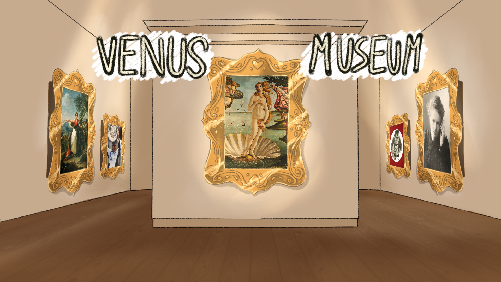

# Venus Museum

</img>

Venus Museum is heavily inspired in Wario Ware. In our game, you traverse a museum finding paintings of relevant women in history and you should help them to achieve their goals. Each painting represents a minigame that references some of their achievements. 

We included some aragonese women like Conchita Martinez, one of the most influential tennis players in the world or Blanca Catalán, considered the first botanic in Spain.
